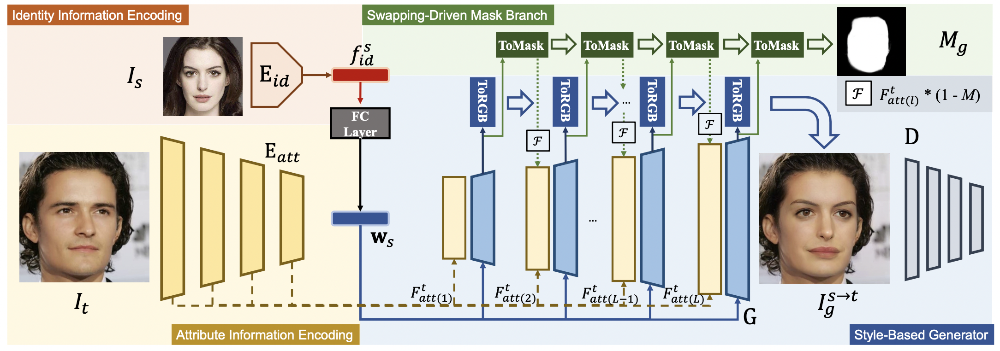

# StyleSwap: Style-Based Generator Empowers Robust Face Swapping (ECCV 2022)

[Zhiliang Xu](https://scholar.google.com/citations?user=93ZNjNgAAAAJ&hl=zh-CN), [Hang Zhou](https://hangz-nju-cuhk.github.io/), [Zhibin Hong](https://scholar.google.com.au/citations?user=9IIxWBsAAAAJ), [Ziwei Liu](https://liuziwei7.github.io/), [Jiaming Liu](https://jmliu88.github.io/), Zhizhi Guo, Junyu Han, Jingtuo Liu, [Errui Ding](https://scholar.google.com/citations?user=1wzEtxcAAAAJ) and [Jingdong Wang](https://jingdongwang2017.github.io/)

---

### [Project](https://hangz-nju-cuhk.github.io/projects/StyleSwap) | [Paper]() | [Demo](https://www.youtube.com/watch?v=bsHhzU8VSLo)

In this work, we introduce a concise and effective framework named **StyleSwap**. Our core idea is to leverage a style-based generator to empower high-fidelity and robust face swapping, thus the generator’s advantage can be adopted for optimizing identity similarity. We identify that with only minimal modifications, a StyleGAN2 architecture can successfully handle the desired information from both source and target. 

---
Code will be released soon
